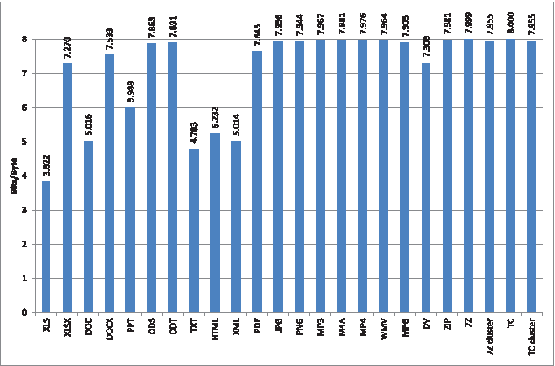

<h3>Forensics, project F3 </h3>
<h1>Experiments on high entropy files</h1>
<hr style="height:2px;border:none;color:#333;background-color:#333;"/>

_Author_
<div class="alert alert-warning">RAFFLIN Corentin </div>

<b> [F3] Entropy vs chi-square vs ??? </b>

> Perform a number of experiments to compute different tests (Shannon entropy, Chi-Square, pi-estimation) on few classes of high entropy files (gzip, jpg, png, encrypted, ..) and plot the distribution of the values. Each group should contains a lot of files (e.g., download from the internet thousands of zip files…)  
How easy is it to distinguish among the different classes?  
Some useful references: http://www.devttys0.com/2013/06/differentiate-encryption-from-compression-using-math/ on the topic, and "Automated Mapping of Large Binary Objects Using Primitive Fragment Type Classification" (paper)  
As additional task (for more points or for larger groups): taking the previous three features + the byte distribution, can we train a machine learning classifier to recognize the file type?


# Overview of the work
<hr style="height:1px;border:none;color:#333;background-color:#333;" />    

<h3> 1) Finding files </h3>

I first looked at which kind of files have high entropy. I found the following figure from a research paper ["Forensic entropy analysis of microsoft windows storage volumes" by Peter Weston, Stephen D. Wolthusen](https://www.semanticscholar.org/paper/Forensic-entropy-analysis-of-microsoft-windows-Weston-Wolthusen/1a1d6b2a80cb9f70431a963a47eeb6f22761b909) :


*Figure 1. Overall File Mean Entropy (by Type). At least 1000 files per format were analysed.*

I decided to focus on files with entropy close to 8 : <b>mp3</b>, <b>jpg</b>, <b>png</b> and <b>zip</b>. I also added <b>pdf</b> to see if it there would be a significant difference as it has an entropy a bit lower (7.7 on average in this experiment).

I tried to obtain at least a thousand files for each type of file. I downloaded most of them from [digitalcorpora](https://digitalcorpora.org/corpora/files) and [cbeditz](https://cbeditz.com/picsart-png/), and took the mp3 files from my personal itunes library.
For the zip files, I used a simple shell command to zip a thousand files of all kind : 
```bash
a=0; for i in *.*; do new=$(printf "%04d.zip" "$a"); zip "$new" "$i"; let a=a+1; rm "$i"; done
```

I did not take care about the size of these files but I made sure that they are a minimum of 5kB. I also made sure to avoid duplicate to not false the results.

<h3> 2) Modification of the ENT program </h3>

I looked at the [ENT program](http://www.fourmilab.ch/random/) which "applies various tests to sequences of bytes stored in files and reports the results of those tests". 

I wanted to be able to easily modify this program for this project. That is why for personal reasons, I tried to find a python version rather than working with the C one. I found this [python version of the ent program](https://github.com/rsmith-nl/ent). I rapidly added the missing printing of the byte occurence that was not implemented in this version. 

I changed the printing format to have the results of the experiments (as well as the byte distribution) on a single line for each file. I also added the file-type extraction from the file name (with output `unknown` in case of no existing extension). I added an option `-n` to the program so that it does not print the header anymore when used in combination with `-t` to print in CSV format. 

<h3> 3) Acquisition phase </h3>

I executed the program on each file and appended the results to a CSV file with the following shell command :
```bash
for i in ./files/*/*; do python3 entmodif.py -t -c "$i" >> results.csv; done
``` 

<h3> 4) Observation phase </h3>

Using a python notebook, I performed the plotting of the distribution of the test for each file. This observation phase is visible in the notebook `observation.ipynb` or in the corresponding HTML version.

<h3> 5) Classifier construction </h3>

Using a python notebook, I build a classifier (after data processing) that is able to find which of the 5 file-type prealably chosen an input file (or more precisely the tests for this input file) correspond to. This model selection and construction is available in the notebook  `classifier.ipynb` or in the corresponding HTML version.

<h3> 6) Completion of the ENT program </h3> 

I added a few options to the `ent.py` python program and try to make the output looking good.  
Firstly and as mentioned above, there is the option `-n` that when used with `-t` will prevent the header from being printed.  
Secondly, the option `-c` allows to print the byte occurence counts. It can be used with or without `-t` and will be adapted to that.  
Furthermore, the option `-f` allows to plot the histogram of the byte distribution using the `matplotlib` library.  
Finally, the option `-p` allows to predict the file type (if the input file has to be in the 5 file-type used to build the classifier) and to compare it with the file extension. This option is not adapted to be used with the option `-t`, i.e the prediction will not be adapted to the CSV format.

If you want to run this program with the python version (so to add modification for example), you will need to install some libraries, otherwise there is a direct executable version for Linux mentioned after. Some libraries include : numpy, matplotlib, pandas and sklearn.
On ubuntu this can be done by running the following command with one of the following instead of `library` : python3-numpy, python3-matplotlib, python3-pandas
```bash 
sudo apt-get install library
```

For `sklearn`, use the following to have the good version : 
```bash  
pip3 install scikit-learn
```
You will also need to have the `scaler_lb_clf.sav` file in the same repository as the python notebook. Indeed the tested file need to be processed with the same scaler and labelEncoder than the one from the training. It is also needed to load the trained classifier.

Otherwise, you can use directly the executable version `entLinux` for Linux version. It is slower to execute than the python version but do not require any library. It was built using the `pyinstaller` program on Ubuntu with the command : 
```bash
./pyinstaller --onefile --add-data="scaler_lb_clf.sav:." ent.py
```

From some tests made, the classifier seems to always predict something with 100% even if the true file type is not in the set of the file type used in the training. It was to be expected but I thought that it could for example predict with a probability of 80% and therefore put a threshold to tell that the classifier does not know the file type.

Attention : there can be a memory error when the program is runned on too large files for your computer. On mine with 8Gb RAM I was not able to analyze a mp4 file of about 500Mb. 
