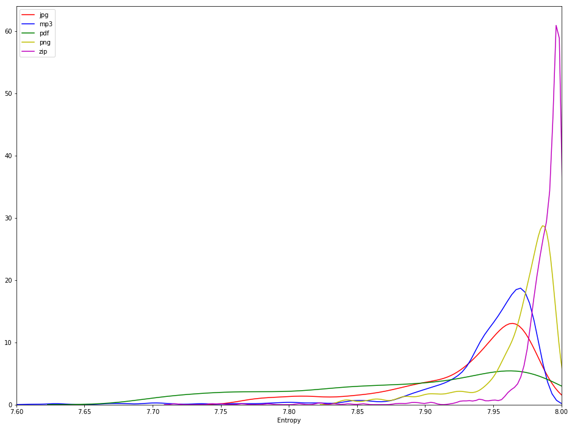
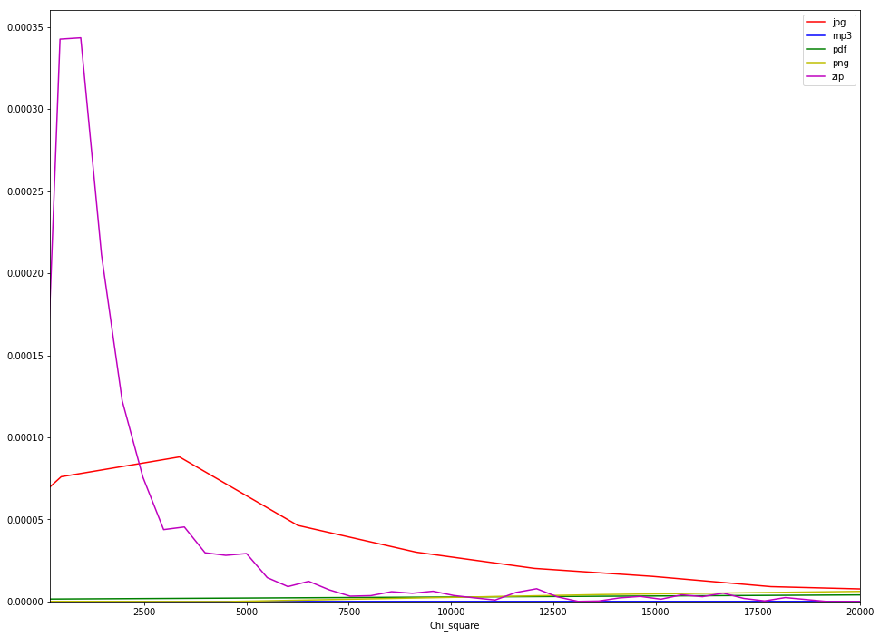
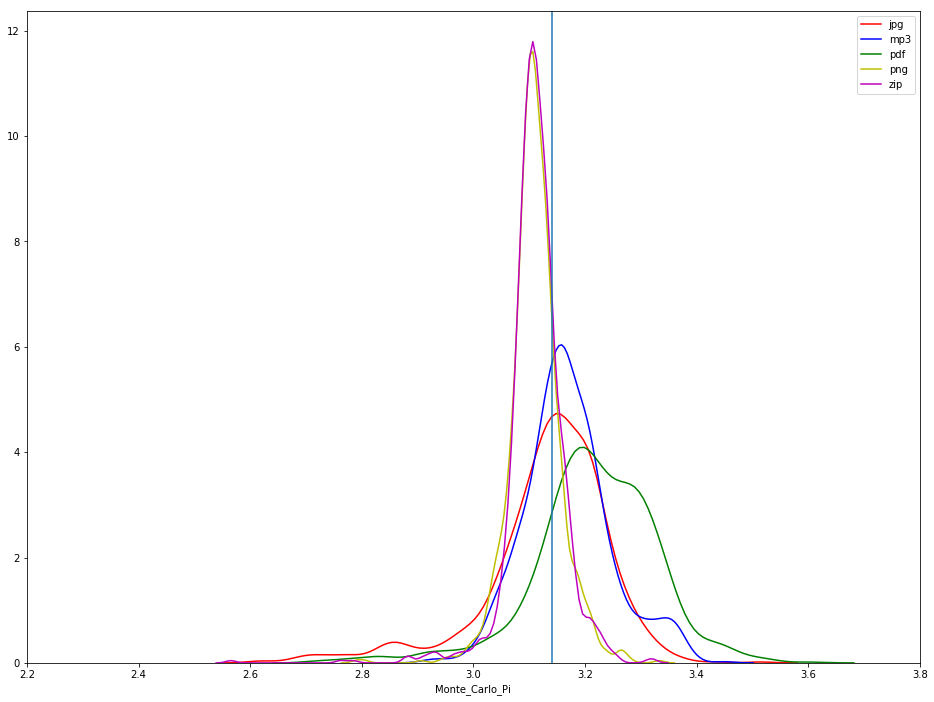
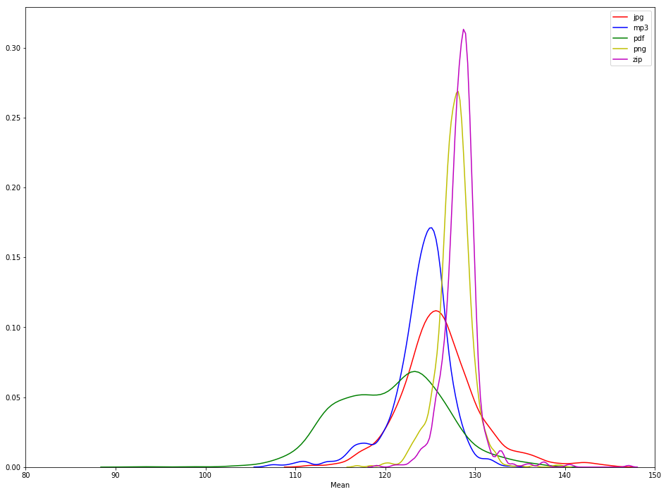
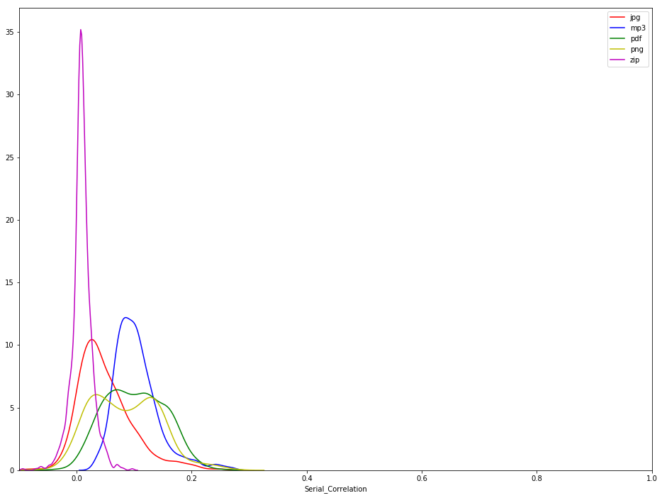
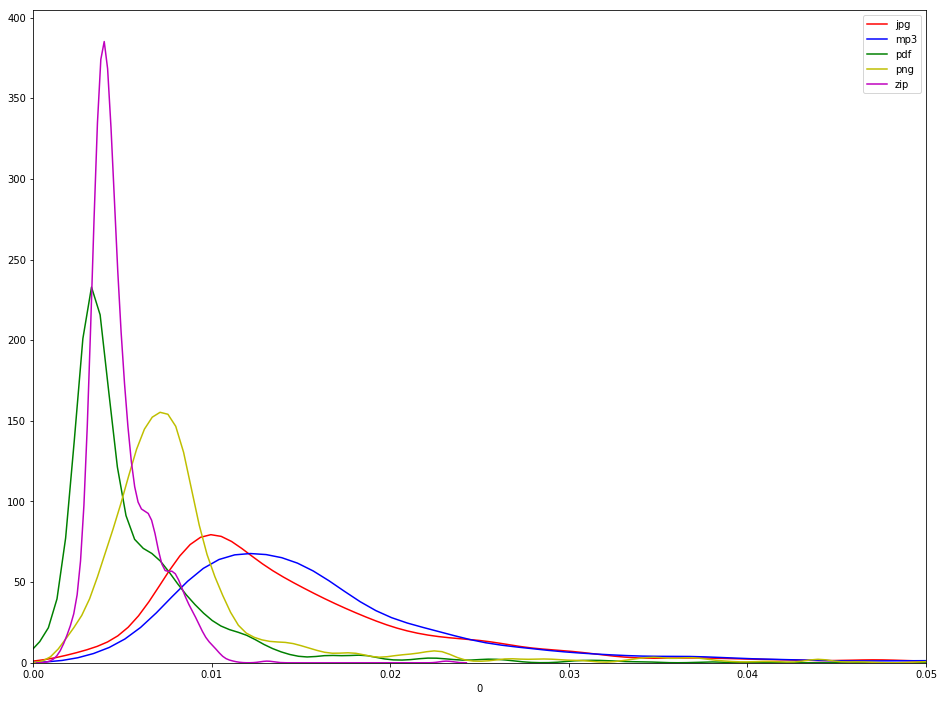
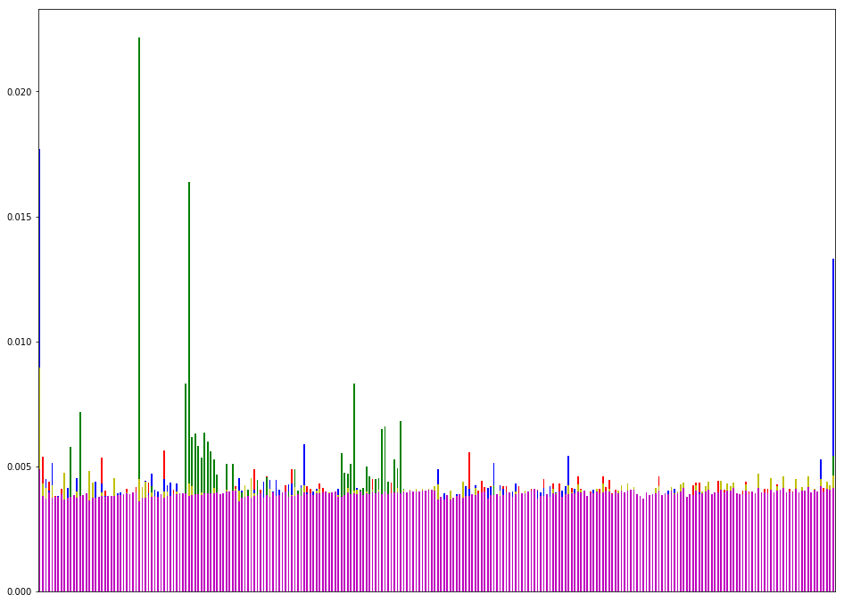
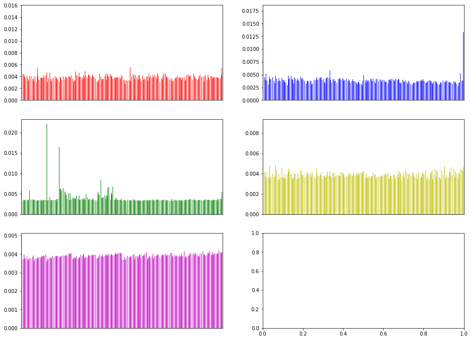

<h3>Forensics, project F3 </h3>
<h1>Experiments on high entropy files</h1>
<hr style="height:2px;border:none;color:#333;background-color:#333;"/>

_Author_
<div class="alert alert-warning">RAFFLIN Corentin </div>

<h2> 4) Observation phase </h2>

The results of the experiments are saved in a file named `results.csv`, this notebook focuses on the plotting of the distribution of the tests for each file type. 

References for most of the quoted text : 
* http://www.devttys0.com/2013/06/differentiate-encryption-from-compression-using-math/
* http://sgros.blogspot.com/2014/12/how-to-determine-if-some-blob-is.html
* http://www.fourmilab.ch/random/

<div class="">
    <h3>1. Loading and treating the data</h3>
</div>


```python
#Diverses libraries
%matplotlib inline
import random
from time import time
import pickle

# Data and plotting imports
import matplotlib.colors as pltcolors
import matplotlib.pyplot as plt
import pandas as pd
import numpy as np
import seaborn as sns
from scipy import stats
```

<h4> Loading the data </h4>


```python
#Path to the CSV file
resultsPath = 'results.csv'

#Header to associate to the CSV file
tests = ['File_type','File_bytes','Entropy','Chi_square','Mean','Monte_Carlo_Pi','Serial_Correlation'] 
cols = tests + [str(i) for i in range(0,256)]
```


```python
#Loading data
data = pd.read_csv(resultsPath, sep=',', header=None, names=cols)
print('There are {} files analyzed'.format(len(data)))
```

    There are 6220 files analyzed


<h4> Removing outliers and balancing the data </h4>


```python
countBefore = data['File_type'].value_counts().to_frame().rename(index=str, columns={'File_type':'Count_before'})

#Removing outliers by keeping only files with high entropy
data = data[data.Entropy>7.6]

countAfter = data['File_type'].value_counts().to_frame().rename(index=str, columns={'File_type':'Count_After'})

count = pd.concat([countBefore, countAfter], axis=1, sort=False)
display(count)
```


<div>
<style scoped>
    .dataframe tbody tr th:only-of-type {
        vertical-align: middle;
    }

    .dataframe tbody tr th {
        vertical-align: top;
    }

    .dataframe thead th {
        text-align: right;
    }
</style>
<table border="1" class="dataframe">
  <thead>
    <tr style="text-align: right;">
      <th></th>
      <th>Count_before</th>
      <th>Count_After</th>
    </tr>
  </thead>
  <tbody>
    <tr>
      <th>pdf</th>
      <td>1613</td>
      <td>1140</td>
    </tr>
    <tr>
      <th>jpg</th>
      <td>1401</td>
      <td>1137</td>
    </tr>
    <tr>
      <th>png</th>
      <td>1136</td>
      <td>1103</td>
    </tr>
    <tr>
      <th>zip</th>
      <td>1035</td>
      <td>1033</td>
    </tr>
    <tr>
      <th>mp3</th>
      <td>1035</td>
      <td>1029</td>
    </tr>
  </tbody>
</table>
</div>


```python
#List of each file type
file_types = data['File_type'].sort_values().unique()

#List of dataframe for each file type 
files = [ data[data.File_type==file_type]  for file_type in file_types]

#Colors to associate to the file types
colors = ['r', 'b', 'g', 'y', 'm']

# In case more colors are needed for addition of other file type
'''
colors = list(pltcolors._colors_full_map.values())
random.seed(2)
random.shuffle(colors)
'''

print("File types :", file_types)
```

    File types : ['jpg' 'mp3' 'pdf' 'png' 'zip']


```python
#Removing some data (lower entropy) to have the same count for each file type
minCount = data['File_type'].value_counts().iloc[-1]
for i in range(len(files)):
    f = files[i]
    f = f.sort_values(by="Entropy")
    files[i] = f[len(f)-minCount:]

#Updating the full dataframe
data = pd.concat(files)
print('There are {} files analyzed'.format(len(data)))
```

    There are 5145 files analyzed


<h4> Checking for missing (possible errors) </h4>


```python
def getMissing(dataframe):
    ''' Printing the missing data in the dataframe with the total of missing and the corresponding percentage '''
    total = dataframe.isnull().sum().sort_values(ascending=False)
    percent = (dataframe.isnull().sum()/dataframe.isnull().count()).sort_values(ascending=False)
    missing_data = pd.concat([total, percent], axis=1, keys=['Total', 'Percent'])
    return missing_data[missing_data['Total']>0]
```


```python
#Checking for missing in the tests or bytes distribution
display(getMissing(data))
```


<div>
<style scoped>
    .dataframe tbody tr th:only-of-type {
        vertical-align: middle;
    }

    .dataframe tbody tr th {
        vertical-align: top;
    }

    .dataframe thead th {
        text-align: right;
    }
</style>
<table border="1" class="dataframe">
  <thead>
    <tr style="text-align: right;">
      <th></th>
      <th>Total</th>
      <th>Percent</th>
    </tr>
  </thead>
  <tbody>
  </tbody>
</table>
</div>


No missing data in the tests which is great.

<h4> Some functions to describe the distribution </h4>


```python
def describeAttribute(attribute):
    '''attribute : string of one of the test performed : Entropy, Chi_square and so on
    return a dataframe describing the distribution of the attribute : mean, quantiles'''
    assert attribute in cols
    alpha = 1e-3 #threshold for telling if a distribution is normal or not
    df = pd.DataFrame(columns=[attribute + '_' + f['File_type'].iloc[0] for f in files])
    for f in files:
        col_name = attribute + '_' + f['File_type'].iloc[0]
        df[col_name] = f.describe()[attribute]
    # Adding skew and kurtosis calculation
    skew = pd.DataFrame([[f[attribute].skew() for f in files]], columns = df.columns).rename(index={0:"skew"})
    kurtosis = pd.DataFrame([[f[attribute].kurt() for f in files]], columns = df.columns).rename(index={0:"kurtosis"})
    df = df.append(skew).append(kurtosis)
    df.drop('count', inplace=True)
    return df

def plotDistributionAttribute(attribute, xmin, xmax):
    '''attribute : string of one of the test performed : Entropy, Chi_square and so on
    plot the distribution of the attribute'''
    assert attribute in cols
    fig = plt.subplots(1,1, figsize=(16,12))
    for i,f in enumerate(files) :
        ax1 = sns.distplot(f[attribute], color=colors[i], hist=False, kde=True, label=file_types[i])
    ax1.set_xlim(xmin, xmax)
    plt.show()
```

<h4> Notions for the description of plots</h4>

> <b> Skewness </b> : 
* A skewness of zero or near zero indicates a symmetric distribution.
* A negative value for the skewness indicate a left skewness (tail to the left)
* A positive value for te skewness indicate a right skewness (tail to the right)

> <b> Kurtosis </b> : 
* Kurtosis is a measure of how extreme observations are in a dataset.
* The greater the kurtosis coefficient , the more peaked the distribution around the mean is.
* Greater coefficient also means fatter tails, which means there is an increase in tail risk (extreme results)

<div class="">
    <h3>2. Data observation</h3>
</div>

<h4> a. Entropy </h4>

> The information density of the contents of the file, expressed as a number of bits per character.  
The entropy can be used as a measure of randomness. 


```python
display(describeAttribute('Entropy'))
```


<div>
<style scoped>
    .dataframe tbody tr th:only-of-type {
        vertical-align: middle;
    }

    .dataframe tbody tr th {
        vertical-align: top;
    }

    .dataframe thead th {
        text-align: right;
    }
</style>
<table border="1" class="dataframe">
  <thead>
    <tr style="text-align: right;">
      <th></th>
      <th>Entropy_jpg</th>
      <th>Entropy_mp3</th>
      <th>Entropy_pdf</th>
      <th>Entropy_png</th>
      <th>Entropy_zip</th>
    </tr>
  </thead>
  <tbody>
    <tr>
      <th>mean</th>
      <td>7.929064</td>
      <td>7.943154</td>
      <td>7.884436</td>
      <td>7.968098</td>
      <td>7.986360</td>
    </tr>
    <tr>
      <th>std</th>
      <td>0.052960</td>
      <td>0.050059</td>
      <td>0.086174</td>
      <td>0.031324</td>
      <td>0.025104</td>
    </tr>
    <tr>
      <th>min</th>
      <td>7.763416</td>
      <td>7.610811</td>
      <td>7.691269</td>
      <td>7.838332</td>
      <td>7.716622</td>
    </tr>
    <tr>
      <th>25%</th>
      <td>7.905675</td>
      <td>7.936889</td>
      <td>7.823102</td>
      <td>7.961788</td>
      <td>7.983959</td>
    </tr>
    <tr>
      <th>50%</th>
      <td>7.947972</td>
      <td>7.956879</td>
      <td>7.903126</td>
      <td>7.978806</td>
      <td>7.992816</td>
    </tr>
    <tr>
      <th>75%</th>
      <td>7.967243</td>
      <td>7.970873</td>
      <td>7.959841</td>
      <td>7.987771</td>
      <td>7.997510</td>
    </tr>
    <tr>
      <th>max</th>
      <td>7.995016</td>
      <td>7.989625</td>
      <td>7.999812</td>
      <td>7.997746</td>
      <td>7.999936</td>
    </tr>
    <tr>
      <th>skew</th>
      <td>-1.346856</td>
      <td>-3.370471</td>
      <td>-0.560782</td>
      <td>-2.059254</td>
      <td>-6.119127</td>
    </tr>
    <tr>
      <th>kurtosis</th>
      <td>1.035181</td>
      <td>14.198656</td>
      <td>-0.852530</td>
      <td>4.078507</td>
      <td>47.532631</td>
    </tr>
  </tbody>
</table>
</div>


```python
plotDistributionAttribute('Entropy', 7.6, 8)
```





* zip entropy distribution has a low standard deviation, the entropy is centered around the maximum 8, there is an important kurtosis
* png entropy distribution has also a low standard deviation and a mean near the maximum, the standard deviation is a bit more important than for zip files, the kurtosis is also high but less than for the zip 

Zip and png are two compression formats which explain why the entropy is always closer to the maximum.
* mp3 and jpeg entropy distributions show a greater standard deviation, entropy is also concentrated near this maximum but is a little more spread with a negative kurtosis and a negative skewness
* pdf entropy distribution shows a negative kurtosis contrary to all other file types, the distribution of entropy is more spread

<h4> b. Chi-square </h4>

> Chi square distribution is used to determine the deviation of observed results from expected results; for example, determining if the outcomes of 10 coin tosses were acceptably random, or if there were potentially external factors that influenced the results. Substantial deviations from the expected values of truly random data indicate a lack of randomness.

>Since each byte in a file can have one of 256 possible values, we would expect a file of random data to have a very even distribution of byte values between 0 and 255 inclusive. We can use the chi square distribution to compare the actual distribution of values to the expected distribution of values and use that comparison to draw conclusions regarding the randomness of data.


> In our case we have 256 values and that translates into 255 degrees of freedom. Next, if we select p=0.05, i.e. we want to determine if the stream of bytes is random with 95% of certainty, then looking into some table we obtain critical value 293.24, rounded it is 300. When Chi square is below that value, then we accept null hypothesis, i.e. the data is random, otherwise we reject null hypothesis, i.e. the data isn't random.

> Lower chi values (< 300) with higher pi error (> .03%) are indicative of compression.  
> Higher chi values (> 300) with lower pi errors (< .03%) are indicative of encryption.


```python
describeAttribute('Chi_square')
```


<div>
<style scoped>
    .dataframe tbody tr th:only-of-type {
        vertical-align: middle;
    }

    .dataframe tbody tr th {
        vertical-align: top;
    }

    .dataframe thead th {
        text-align: right;
    }
</style>
<table border="1" class="dataframe">
  <thead>
    <tr style="text-align: right;">
      <th></th>
      <th>Chi_square_jpg</th>
      <th>Chi_square_mp3</th>
      <th>Chi_square_pdf</th>
      <th>Chi_square_png</th>
      <th>Chi_square_zip</th>
    </tr>
  </thead>
  <tbody>
    <tr>
      <th>mean</th>
      <td>11433.584275</td>
      <td>7.426412e+05</td>
      <td>1.412822e+05</td>
      <td>1.301405e+04</td>
      <td>2287.943991</td>
    </tr>
    <tr>
      <th>std</th>
      <td>23109.322077</td>
      <td>2.192427e+06</td>
      <td>3.176460e+05</td>
      <td>4.995752e+04</td>
      <td>5418.249763</td>
    </tr>
    <tr>
      <th>min</th>
      <td>318.215202</td>
      <td>4.366983e+04</td>
      <td>8.823298e+02</td>
      <td>2.605258e+02</td>
      <td>224.880459</td>
    </tr>
    <tr>
      <th>25%</th>
      <td>1738.958685</td>
      <td>1.935876e+05</td>
      <td>2.680575e+04</td>
      <td>1.241132e+03</td>
      <td>424.332459</td>
    </tr>
    <tr>
      <th>50%</th>
      <td>4168.399528</td>
      <td>3.267062e+05</td>
      <td>5.416200e+04</td>
      <td>3.164127e+03</td>
      <td>757.224615</td>
    </tr>
    <tr>
      <th>75%</th>
      <td>11308.864865</td>
      <td>5.929257e+05</td>
      <td>1.117071e+05</td>
      <td>9.437639e+03</td>
      <td>1776.350361</td>
    </tr>
    <tr>
      <th>max</th>
      <td>356282.662341</td>
      <td>2.528651e+07</td>
      <td>4.661441e+06</td>
      <td>1.147716e+06</td>
      <td>62970.547602</td>
    </tr>
    <tr>
      <th>skew</th>
      <td>6.566269</td>
      <td>8.099815e+00</td>
      <td>6.563258e+00</td>
      <td>1.492738e+01</td>
      <td>6.299277</td>
    </tr>
    <tr>
      <th>kurtosis</th>
      <td>66.597105</td>
      <td>7.010884e+01</td>
      <td>6.064575e+01</td>
      <td>2.933722e+02</td>
      <td>49.079821</td>
    </tr>
  </tbody>
</table>
</div>


```python
plotDistributionAttribute('Chi_square', 200, 2.0e+04)
```





* zip chi-square distribution show that most files have a very low chi-square which is expected for a compression format
* jpg files also have mostly a low chi-square but this is more distributed
* png files show a low mean chi-square but the standard deviation and the skewness are important
* For the other file types, the chi-square is higher when looking at the mean value but it is also very distributed as one can noticed with the standard deviation, especially for the mp3.

<h4> c. Monte Carlo pi approximation </h4>

> Each successive sequence of six bytes is used as 24 bit X and Y co-ordinates within a square. If the distance of the randomly-generated point is less than the radius of a circle inscribed within the square, the six-byte sequence is considered a “hit”. The percentage of hits can be used to calculate the value of Pi. For very large streams (this approximation converges very slowly), the value will approach the correct value of Pi if the sequence is close to random.

> Monte Carlo pi approximation  is used to approximate the value of pi from a given set of random (x,y) coordinates; the more unique well distributed data points, the closer the approximation should be to the actual value of pi. Very accurate pi approximations indicate a very random set of data points.

> Very accurate pi calculations (< .01% error) are sure signs of encryption.


```python
describeAttribute('Monte_Carlo_Pi')
```


<div>
<style scoped>
    .dataframe tbody tr th:only-of-type {
        vertical-align: middle;
    }

    .dataframe tbody tr th {
        vertical-align: top;
    }

    .dataframe thead th {
        text-align: right;
    }
</style>
<table border="1" class="dataframe">
  <thead>
    <tr style="text-align: right;">
      <th></th>
      <th>Monte_Carlo_Pi_jpg</th>
      <th>Monte_Carlo_Pi_mp3</th>
      <th>Monte_Carlo_Pi_pdf</th>
      <th>Monte_Carlo_Pi_png</th>
      <th>Monte_Carlo_Pi_zip</th>
    </tr>
  </thead>
  <tbody>
    <tr>
      <th>mean</th>
      <td>3.132395</td>
      <td>3.169305</td>
      <td>3.216731</td>
      <td>3.110773</td>
      <td>3.111973</td>
    </tr>
    <tr>
      <th>std</th>
      <td>0.113332</td>
      <td>0.077971</td>
      <td>0.112775</td>
      <td>0.046686</td>
      <td>0.051268</td>
    </tr>
    <tr>
      <th>min</th>
      <td>2.612035</td>
      <td>2.912495</td>
      <td>2.718736</td>
      <td>2.790441</td>
      <td>2.565631</td>
    </tr>
    <tr>
      <th>25%</th>
      <td>3.090320</td>
      <td>3.122002</td>
      <td>3.159924</td>
      <td>3.087422</td>
      <td>3.091047</td>
    </tr>
    <tr>
      <th>50%</th>
      <td>3.148330</td>
      <td>3.163826</td>
      <td>3.218661</td>
      <td>3.109189</td>
      <td>3.111378</td>
    </tr>
    <tr>
      <th>75%</th>
      <td>3.204455</td>
      <td>3.210817</td>
      <td>3.291864</td>
      <td>3.133591</td>
      <td>3.136040</td>
    </tr>
    <tr>
      <th>max</th>
      <td>3.513654</td>
      <td>3.449399</td>
      <td>3.604451</td>
      <td>3.333215</td>
      <td>3.322400</td>
    </tr>
    <tr>
      <th>skew</th>
      <td>-1.352494</td>
      <td>0.381811</td>
      <td>-0.768399</td>
      <td>-0.373953</td>
      <td>-2.091400</td>
    </tr>
    <tr>
      <th>kurtosis</th>
      <td>3.208018</td>
      <td>0.590537</td>
      <td>2.380297</td>
      <td>5.312529</td>
      <td>18.207205</td>
    </tr>
  </tbody>
</table>
</div>


```python
#adding this time a vertical line for pi
fig = plt.subplots(1,1, figsize=(16,12))
for i,f in enumerate(files) :
    ax1 = sns.distplot(f['Monte_Carlo_Pi'], color=colors[i], hist=False, kde=True, label=file_types[i])
ax1.set_xlim(2.2, 3.8)
plt.axvline(x=3.14159265358979323846)
plt.show()
```





* png and zip monte-carlo pi approximations have almost the same distribution, they are really centered with an important kurtosis, but not at the exact pi value as we could expect.
* mp3 and jpeg monte-carlo pi approximation distributions show a low kurtosis, they are centered around the actual value of pi.
* pdf files distribution is more spread with an important standard deviation.

<h4> d. Mean </h4>

> This is simply the result of summing the all the bytes (bits if the -b option is specified) in the file and dividing by the file length. If the data are close to random, this should be about 127.5 (0.5 for -b option output). If the mean departs from this value, the values are consistently high or low.

> Mean: if test source is long enough this value shouldn't be off by much; more than 10% off from 127.5 would be suspect (ie: > 140.25 or < 114.75)


```python
describeAttribute('Mean')
```


<div>
<style scoped>
    .dataframe tbody tr th:only-of-type {
        vertical-align: middle;
    }

    .dataframe tbody tr th {
        vertical-align: top;
    }

    .dataframe thead th {
        text-align: right;
    }
</style>
<table border="1" class="dataframe">
  <thead>
    <tr style="text-align: right;">
      <th></th>
      <th>Mean_jpg</th>
      <th>Mean_mp3</th>
      <th>Mean_pdf</th>
      <th>Mean_png</th>
      <th>Mean_zip</th>
    </tr>
  </thead>
  <tbody>
    <tr>
      <th>mean</th>
      <td>126.153098</td>
      <td>123.942944</td>
      <td>120.622939</td>
      <td>127.679232</td>
      <td>128.428503</td>
    </tr>
    <tr>
      <th>std</th>
      <td>4.527088</td>
      <td>3.378010</td>
      <td>5.842546</td>
      <td>1.942252</td>
      <td>1.897978</td>
    </tr>
    <tr>
      <th>min</th>
      <td>111.611159</td>
      <td>107.283050</td>
      <td>92.989800</td>
      <td>116.872443</td>
      <td>119.074209</td>
    </tr>
    <tr>
      <th>25%</th>
      <td>123.582687</td>
      <td>122.707554</td>
      <td>116.357174</td>
      <td>126.788802</td>
      <td>127.572417</td>
    </tr>
    <tr>
      <th>50%</th>
      <td>125.838940</td>
      <td>124.527998</td>
      <td>121.159780</td>
      <td>127.798889</td>
      <td>128.503762</td>
    </tr>
    <tr>
      <th>75%</th>
      <td>128.395008</td>
      <td>125.918537</td>
      <td>124.558811</td>
      <td>128.711838</td>
      <td>129.262628</td>
    </tr>
    <tr>
      <th>max</th>
      <td>144.863237</td>
      <td>134.134176</td>
      <td>137.156481</td>
      <td>139.557750</td>
      <td>147.058994</td>
    </tr>
    <tr>
      <th>skew</th>
      <td>0.668621</td>
      <td>-1.405594</td>
      <td>-0.131644</td>
      <td>-0.214821</td>
      <td>1.594897</td>
    </tr>
    <tr>
      <th>kurtosis</th>
      <td>2.012856</td>
      <td>3.955308</td>
      <td>0.263285</td>
      <td>5.006744</td>
      <td>15.116074</td>
    </tr>
  </tbody>
</table>
</div>


```python
plotDistributionAttribute('Mean', 80, 150)
```





Once more a similar observation can be made.
* zip and png mean distribution have similar shape with an important kurtosis, but always a greater kurtosis for the zip distribution. 
* mp3 mean distribution has still an intermediate kurtosis between the ones for zip and png
* jpeg mean distribution has the second lower kurtosis after pdf
* pdf mean distribution is really skewed. 


<h4> e. Serial correlation </h4>

> This quantity measures the extent to which each byte in the file depends upon the previous byte. For random sequences, this value (which can be positive or negative) will, of course, be close to zero. A non-random byte stream such as a C program will yield a serial correlation coefficient on the order of 0.5. Wildly predictable data such as uncompressed bitmaps will exhibit serial correlation coefficients approaching 1. 


```python
describeAttribute('Serial_Correlation')
```


<div>
<style scoped>
    .dataframe tbody tr th:only-of-type {
        vertical-align: middle;
    }

    .dataframe tbody tr th {
        vertical-align: top;
    }

    .dataframe thead th {
        text-align: right;
    }
</style>
<table border="1" class="dataframe">
  <thead>
    <tr style="text-align: right;">
      <th></th>
      <th>Serial_Correlation_jpg</th>
      <th>Serial_Correlation_mp3</th>
      <th>Serial_Correlation_pdf</th>
      <th>Serial_Correlation_png</th>
      <th>Serial_Correlation_zip</th>
    </tr>
  </thead>
  <tbody>
    <tr>
      <th>mean</th>
      <td>0.049980</td>
      <td>0.104703</td>
      <td>0.101387</td>
      <td>0.084576</td>
      <td>0.009017</td>
    </tr>
    <tr>
      <th>std</th>
      <td>0.047601</td>
      <td>0.039274</td>
      <td>0.051708</td>
      <td>0.059055</td>
      <td>0.017726</td>
    </tr>
    <tr>
      <th>min</th>
      <td>-0.094433</td>
      <td>0.030311</td>
      <td>-0.084760</td>
      <td>-0.104619</td>
      <td>-0.093801</td>
    </tr>
    <tr>
      <th>25%</th>
      <td>0.016830</td>
      <td>0.078382</td>
      <td>0.061461</td>
      <td>0.034408</td>
      <td>0.001277</td>
    </tr>
    <tr>
      <th>50%</th>
      <td>0.040040</td>
      <td>0.098388</td>
      <td>0.099239</td>
      <td>0.082098</td>
      <td>0.008700</td>
    </tr>
    <tr>
      <th>75%</th>
      <td>0.074082</td>
      <td>0.122198</td>
      <td>0.140885</td>
      <td>0.130261</td>
      <td>0.017284</td>
    </tr>
    <tr>
      <th>max</th>
      <td>0.254598</td>
      <td>0.273318</td>
      <td>0.266762</td>
      <td>0.278844</td>
      <td>0.096479</td>
    </tr>
    <tr>
      <th>skew</th>
      <td>1.045505</td>
      <td>1.329994</td>
      <td>0.082664</td>
      <td>0.283194</td>
      <td>-0.132484</td>
    </tr>
    <tr>
      <th>kurtosis</th>
      <td>1.736708</td>
      <td>2.610558</td>
      <td>-0.542953</td>
      <td>-0.292896</td>
      <td>3.638427</td>
    </tr>
  </tbody>
</table>
</div>


```python
plotDistributionAttribute('Serial_Correlation', -0.1, 1)
```





This time the observation is different
* For the zip serial-correlation distribution, it does not change much : important kurtosis, no skewness. It is expected for a random sequence of a compressed file.
* Png serial-correlation distribution is not following anymore a similar shape as zip, it is not anymore centered, the standard deviation being important. Fortunately, this may allow the model to differentiate zip and png.
* mp3 serial-correlation distribution has still the same shape, though it is not centered around the 0 because there are relation between bytes.
* pdf serial-correlation distribution is close to the png one with an important standard deviation and low kurtosis as in every previous distribution.

<h4> f. Byte distribution </h4>

> Namely, by looking at the distribution of octets in a file you can know if it is encrypted or not. The point is that after encryption the file must look like a random sequence of bytes. So, every byte, from 0 to 255, will occur almost the same number of times in a file. 


> On the other hand, text files, images, and other files will have some bytes occurring more frequently than the others. For example, in text files space (0x20) occurs most frequently. So, the procedure is very easy, just count how many times each octet occurs in the file and then look at the differences. 


```python
describeAttribute('0')
```


<div>
<style scoped>
    .dataframe tbody tr th:only-of-type {
        vertical-align: middle;
    }

    .dataframe tbody tr th {
        vertical-align: top;
    }

    .dataframe thead th {
        text-align: right;
    }
</style>
<table border="1" class="dataframe">
  <thead>
    <tr style="text-align: right;">
      <th></th>
      <th>0_jpg</th>
      <th>0_mp3</th>
      <th>0_pdf</th>
      <th>0_png</th>
      <th>0_zip</th>
    </tr>
  </thead>
  <tbody>
    <tr>
      <th>mean</th>
      <td>0.015261</td>
      <td>0.017688</td>
      <td>0.005773</td>
      <td>0.008934</td>
      <td>0.004883</td>
    </tr>
    <tr>
      <th>std</th>
      <td>0.009294</td>
      <td>0.013415</td>
      <td>0.005036</td>
      <td>0.006662</td>
      <td>0.001747</td>
    </tr>
    <tr>
      <th>min</th>
      <td>0.002327</td>
      <td>0.003225</td>
      <td>0.000152</td>
      <td>0.001680</td>
      <td>0.001300</td>
    </tr>
    <tr>
      <th>25%</th>
      <td>0.009441</td>
      <td>0.010664</td>
      <td>0.003138</td>
      <td>0.005750</td>
      <td>0.003769</td>
    </tr>
    <tr>
      <th>50%</th>
      <td>0.012468</td>
      <td>0.014160</td>
      <td>0.003926</td>
      <td>0.007356</td>
      <td>0.004358</td>
    </tr>
    <tr>
      <th>75%</th>
      <td>0.018135</td>
      <td>0.019372</td>
      <td>0.006879</td>
      <td>0.009203</td>
      <td>0.005663</td>
    </tr>
    <tr>
      <th>max</th>
      <td>0.065621</td>
      <td>0.104584</td>
      <td>0.057096</td>
      <td>0.053323</td>
      <td>0.023147</td>
    </tr>
    <tr>
      <th>skew</th>
      <td>2.115601</td>
      <td>3.485791</td>
      <td>4.043907</td>
      <td>3.275987</td>
      <td>2.089283</td>
    </tr>
    <tr>
      <th>kurtosis</th>
      <td>5.737218</td>
      <td>15.297579</td>
      <td>26.283356</td>
      <td>12.857350</td>
      <td>12.036998</td>
    </tr>
  </tbody>
</table>
</div>


```python
plotDistributionAttribute('0', 0, 0.05)
```





The distribution of the 0 byte is quite remarkable for pdf with regard to the previous distributions, it is more centered and has the greater kurtosis. We can expect the byte distribution to be more important features for the classifier than the statistical tests. 


```python
def getFrequencies(statistic):
    '''statistic : string like std, mean, min, 25%...
    return a dataframe describing the statistic of byte distribution'''
    experiences = tests
    if 'File_type' in experiences:
        experiences.remove('File_type')
    rows = ['count', 'mean', 'std', 'min', '25%', '50%', '75%', 'max']
    assert statistic in rows
    rows.remove(statistic)
    df = pd.DataFrame(columns=[statistic + '_' + f['File_type'].iloc[0] for f in files])
    for f in files:
        col_name = statistic + '_' + f['File_type'].iloc[0]
        stats = f.describe().drop(experiences, axis=1)
        df[col_name] = stats.drop(rows).transpose()[statistic]
    return df    
```


```python
mean = getFrequencies('mean')
display(mean.head())
```


<div>
<style scoped>
    .dataframe tbody tr th:only-of-type {
        vertical-align: middle;
    }

    .dataframe tbody tr th {
        vertical-align: top;
    }

    .dataframe thead th {
        text-align: right;
    }
</style>
<table border="1" class="dataframe">
  <thead>
    <tr style="text-align: right;">
      <th></th>
      <th>mean_jpg</th>
      <th>mean_mp3</th>
      <th>mean_pdf</th>
      <th>mean_png</th>
      <th>mean_zip</th>
    </tr>
  </thead>
  <tbody>
    <tr>
      <th>0</th>
      <td>0.015261</td>
      <td>0.017688</td>
      <td>0.005773</td>
      <td>0.008934</td>
      <td>0.004883</td>
    </tr>
    <tr>
      <th>1</th>
      <td>0.005370</td>
      <td>0.004327</td>
      <td>0.003482</td>
      <td>0.004313</td>
      <td>0.003825</td>
    </tr>
    <tr>
      <th>2</th>
      <td>0.004377</td>
      <td>0.004500</td>
      <td>0.003327</td>
      <td>0.004118</td>
      <td>0.003702</td>
    </tr>
    <tr>
      <th>3</th>
      <td>0.004401</td>
      <td>0.004043</td>
      <td>0.003468</td>
      <td>0.003717</td>
      <td>0.003966</td>
    </tr>
    <tr>
      <th>4</th>
      <td>0.003979</td>
      <td>0.005125</td>
      <td>0.003520</td>
      <td>0.004244</td>
      <td>0.003750</td>
    </tr>
  </tbody>
</table>
</div>


```python
fig = plt.subplots(1,1, figsize=(16,12))
for i,col in enumerate(mean.columns):
    mean[col].plot(kind='bar', ax=plt.gca(), color=colors[i], label=file_types[i]) #label is not working but same color as before
plt.xticks([])
plt.show()
```





```python
fig , ((ax1, ax2), (ax3, ax4), (ax5, ax6 )) = plt.subplots(3,2, figsize=(16,12))
axes = [ax1, ax2, ax3, ax4, ax5]
for i,col in enumerate(mean.columns):
    mean[col].plot(kind='bar', ax=axes[i], color=colors[i], label=file_types[i]) #label is not working but same color as before
    axes[i].get_xaxis().set_visible(False)
    if i>4:
        break
plt.show()
```





All files except pdf files have almost uniform bytes distribution because of the randomness but still with some patterns that may be recognized by the classifier.
